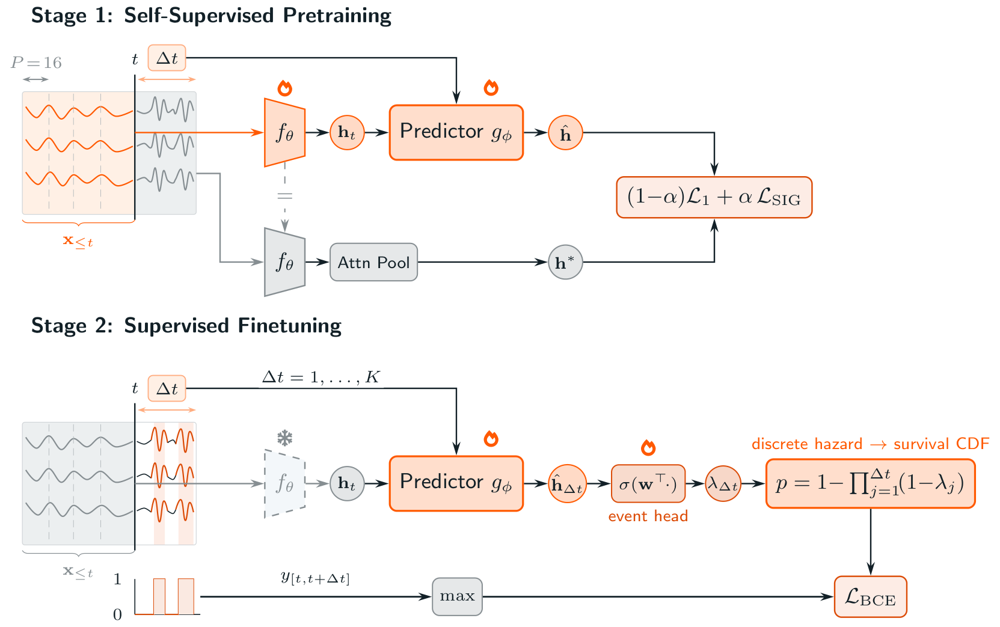
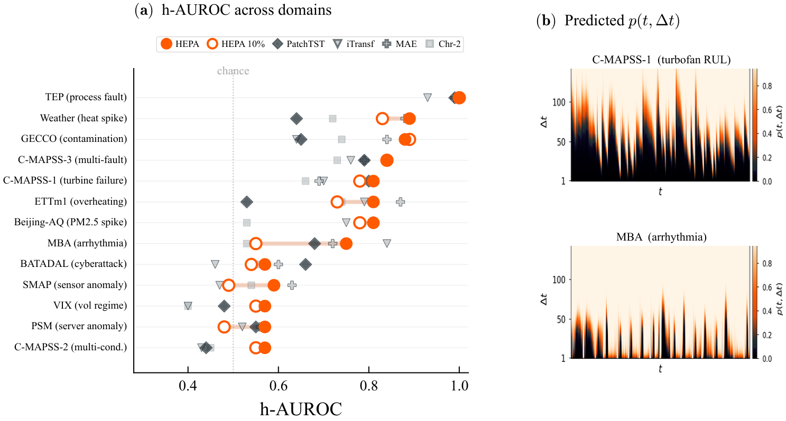

# HEPA: A Self-Supervised Horizon-Conditioned Event Predictive Architecture for Time Series

[](https://creativecommons.org/licenses/by-nc-sa/4.0/)

**Team:** Anonymous authors (under double-blind review)

Critical events in multivariate time series, from turbine failures to cardiac arrhythmias, demand accurate prediction, yet labeled data is scarce because such events are rare and costly to annotate. We introduce HEPA (Horizon-conditioned Event Predictive Architecture), built on two key principles. First, a causal Transformer encoder is pretrained via a Joint-Embedding Predictive Architecture (JEPA): a horizon-conditioned predictor learns to forecast future representations rather than future values, forcing the encoder to capture predictable temporal dynamics from unlabeled data alone. Second, we freeze the encoder and finetune only the predictor toward the target event, producing a monotonic survival cumulative distribution function (CDF) over horizons. With fixed architecture and optimiser hyperparameters across all benchmarks, HEPA handles water contamination, cyberattack detection, volatility regimes, and eight further event types across 11 domains, exceeding leading time-series architectures including PatchTST, iTransformer, MAE, and Chronos-2 on at least 10 of 14 benchmarks, with an order of magnitude fewer tuned parameters and, on lifecycle datasets, an order of magnitude less labeled data.

<p align="center">
  
</p>

## Contributions

1. **One architecture, any event, any domain.** A single 2.16M-parameter architecture with fixed hyperparameters, evaluated on 14 benchmarks across 11 domains. HEPA wins on 10 out of 14 while tuning 11x fewer parameters than PatchTST.
2. **Predictor finetuning as the downstream recipe.** Freezing the encoder and finetuning only the predictor and event head (~198K params). On C-MAPSS, HEPA retains 92% of full-label h-AUROC at just 2% of labels.

## Results

<p align="center">
  
</p>

## Quick Start

```bash
pip install -e .

# 1. Get the data (prints per-dataset sources and the expected layout)
export HEPA_DATA_DIR=/path/to/data
python scripts/download_data.py FD001

# 2. Pretrain + finetune + evaluate on C-MAPSS FD001
python scripts/train.py --dataset FD001 --seed 42
```

PyTorch >= 2.0 required. CPU works for unit tests; a single GPU is recommended for full training (a few minutes per dataset on an A10G).

Two settings are chosen per dataset (handled automatically): C-MAPSS uses a global
z-score with no per-window RevIN and a fixed-epoch finetune; all other datasets use
RevIN with early-stopped finetuning. Horizons are dense unit-step (K=150 for
C-MAPSS/TEP, K=200 otherwise). See **[REPRODUCIBILITY.md](REPRODUCIBILITY.md)** for
the full protocol and expected h-AUROC per dataset.

> _Note:_ this repository's C-MAPSS h-AUROC values are higher than those in the
> paper. There, the C-MAPSS finetune used validation-loss early stopping, whose stop
> point is sensitive on these datasets; here it runs for a fixed epoch budget, which is
> deterministic and reproducible. All other datasets are unchanged.

## Supported Datasets

| Dataset | Domain | Channels |
|---------|--------|-------:|
| FD001-004 | Turbofan engine degradation | 14 |
| SMAP | Spacecraft telemetry | 25 |
| PSM | Server metrics | 25 |
| MBA | Cardiac ECG arrhythmia | 2 |
| GECCO | Drinking water quality | 9 |
| BATADAL | Water-distribution attacks | 43 |
| TEP | Chemical-plant faults | 52 |
| ETTm1 | Electricity transformer load | 7 |
| Weather | Climate forecasting | 21 |
| BeijingAQ | Air quality / public health | 11 |
| VIX | Financial volatility | 6 |

## Citation

```bibtex
@article{hepa2026,
  title   = {HEPA: A Self-Supervised Horizon-Conditioned Event Predictive
             Architecture for Time Series},
  author  = {Anonymous authors},
  note    = {Under double-blind review; author list and venue redacted},
  year    = {2026}
}
```

## License

Copyright (c) 2026, Anonymous authors. Licensed under [CC BY-NC-SA 4.0](LICENSE).
